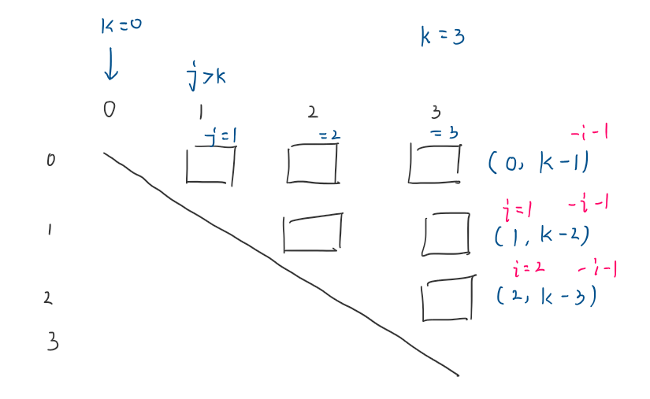

## B. Balls of Steel

### 我的思路

### 总结

#### 错误一

一开始的思路正确，在遍历造的是否符合distance的数组时，思路错误。

主要表现在，对数组中元素的位置了解的不够清晰，找错了位置，导致使用DEBUG才发现错误。

#### 错误二

本题是要找正确的情况，而一开始我在找是否有不正确的情况。这属于明显的脑子发昏…

#### 思路改进

下次可以尝试把取该值的条件写上，分析出通项式，这样可能能减少失误。

